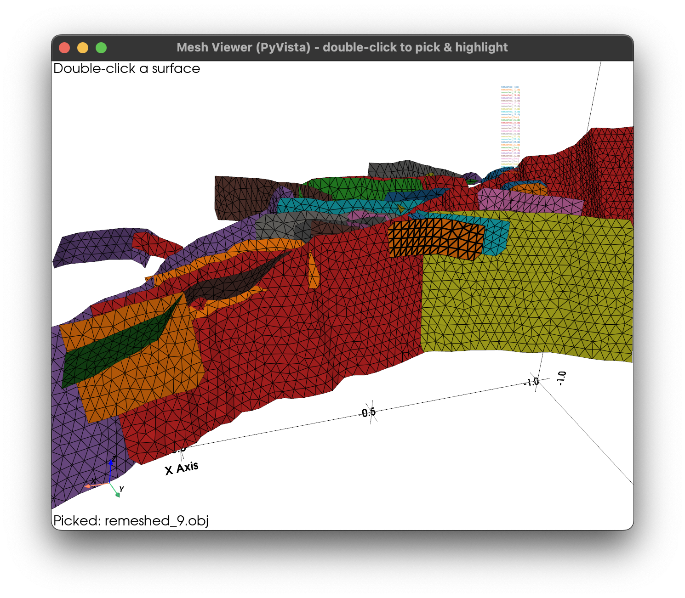
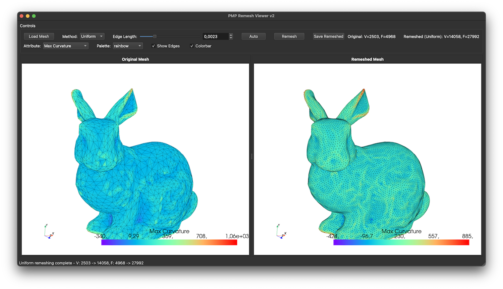
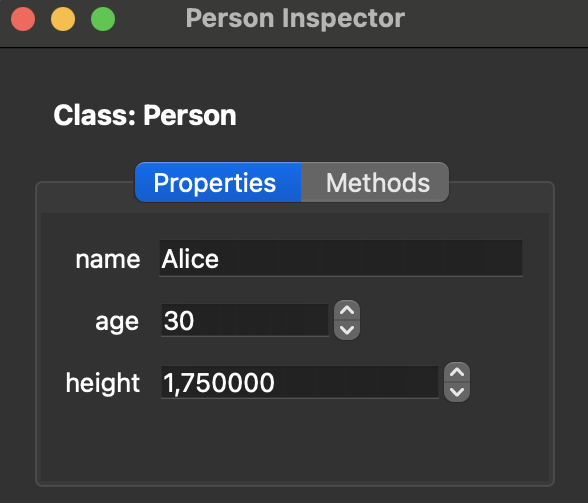
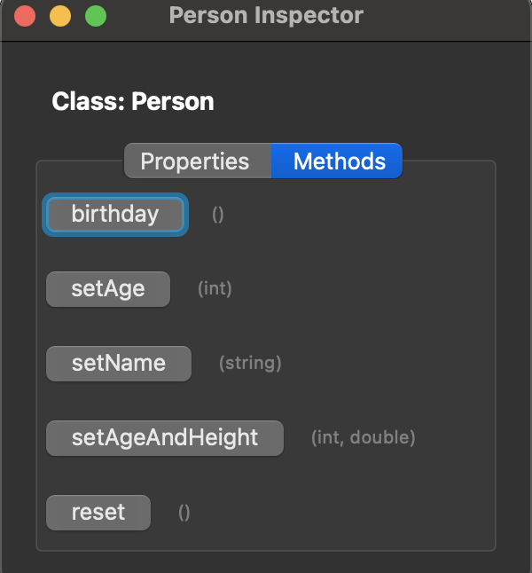

# Rosetta — A C++ Introspection & Automatic Language Binding

# **One registration, infinite possibilities** 🚀

<p align="center">
  
</p>

<p align="center">
  
  
  <br>
  
  
</p>
With support to:
<p align="left">
<div style="padding-left: 50px;">
  <br>
  <br>
  <br>
  <br>
  <br>
  <br>
  <br>
  <br>
  <br>
  
  </div>
</p>

---

## 🧩 Overview

**Rosetta** is a **non-intrusive C++ header-only introspection library** that is used to automatically generates consistent bindings for Python, JavaScript, Lua, Ruby, Julia and more — without modifying your C++ code.

Describe your introspection once, and export them everywhere. You do not need to know anything about the underlaying libs that are used for the bindings (NAPI, Pybind11, Rice...)

## Examples
- [CGAL-rosetta](https://github.com/xaliphostes/cgal-rosetta) based on the [CGAL](https://github.com/CGAL/cgal) library, for 3D surfaces intersections and remeshing

  

- [PMP-rosetta](https://github.com/xaliphostes/pmp-rosetta) based on the [PMP](https://github.com/pmp-library/pmp-library) library, for decimation, remeshing, subdivision or smoothing

  

- [Arch-rosetta](https://github.com/xaliphostes/arch3-rosetta) based on the [Arch](https://github.com/xaliphostes/arch3) library, the successor of [Poly3D](https://structuralgeology.stanford.edu) from Stanford and [iBem3D](https://www.sciencedirect.com/science/article/abs/pii/S0098300414001496#:~:text=Review-,iBem3D%2C%20a%20three-dimensional%20iterative%20boundary%20element%20method%20using%20angular,dislocations%20for%20modeling%20geologic%20structures) from slb, a 3D Boundary Element Method in geomechanics

  

## 🧩 Usages

1. **C++ Introspection**
2. **Generator** for `scripting languages`
   - Python
   - JavScript
   - WebAssembly
   - TypeScript
   - Rest API
   - ...
3. **Property editor (GUI)**
   - Qt
   - ImGui
4. **Serialization**
5. **Undo/redo** framework
6. **Documentation** generation in `Markdown`
7. **Validation** on `field` or `property` (range...)


---

## ✨ Features

1. **Zero-intrusion** — No inheritance, no macros inside your classes, no wrapper
2. **Simple to use**
3. **One API -> Multi-language output** — Python (pybind11), JavaScript (N-API), Lua, WASM...
4. Supports:
   - **Multiple constructors**
   - **Inheritance & polymorphism** — Virtual methods, multiple inheritance
   - **Const correctness** — Differentiates const/non-const methods
   - **Method Complete Overload Access**
   - **Synthetic Methods** - methods to classes that don't exist in the original C++ class definition.
   - **Functors**
   - **Fields** - Member variables
   - **Virtual fields (`property`)** - From `setDummy`/`getDummy` methods, create the virtual field `dummy`
   - **Static methods**
   - **Free functions**
   - **STL Containers** — `vector`, `map`, `set`, `array`, etc... of any type
   - **Smart pointers** — `shared_ptr`, `unique_ptr`, raw pointers
1.  **Validation system** — Runtime constraints and checks
2.  **Serialization**
3.  **Documentation generation** — Markdown / HTML export
5.  **Qt Integration** — QML bridge for dynamic property editing, automatic property editor widgets
6.  **Undo/Redo extension** - Generic undo/redo manager for tracking and reverting property/field changes
  
## 📊 Comparison with Other Systems

| Feature | Rosetta | Qt MOC | RTTR | Boost.Describe |
|---------|---------|--------|------|----------------|
| Non-intrusive | ✅ | ❌ | ✅ | ✅ |
| No macros in class | ✅ | ❌ | ❌ | ❌ |
| Header-only | ✅ | ❌ | ❌ | ✅ |
| Static methods | ✅ | ✅ | ✅ | ⚠️ |
| Virtual methods | ✅ | ✅ | ✅ | ❌ |
| Free functions | ✅ | ❌ | ✅ | ❌ |
| Python bindings | ✅ | ✅ | ⚠️ | ❌ |
| JavaScript bindings | ✅ | ❌ | ❌ | ❌ |
| WebAssembly bindings | ✅ | ❌ | ❌ | ❌ |
| REST API generation | ✅ | ❌ | ❌ | ❌ |
| Serialization | ✅ | ✅ | ✅ | ⚠️ |
| Qt integration | ✅ | ✅ | ⚠️ | ❌ |

### Legends

| Symbol | Meaning | Description |
|--------|---------|-------------|
| ✅ | **Fully Supported** | Feature is implemented, stable, and works as expected |
| ⚠️ | **Partial Support** | Feature exists but has limitations, requires workarounds, or is incomplete |
| ❌ | **Not Supported** | Feature is not available or not applicable |
| 🚧 | **In Progress** | Feature is being developed or planned |

## 🚀 Short overview

### 1. Your lib
```cpp
class Vector3D {...};
class SceneManager {...};
...
```
along with a static or dynamic library or nothing (if headers only).

### 2. Describe your API with Rosetta and generate the binding for any language 
This description provide the introspection of your classes that will be used by the generators (see below).
```cpp
#include <rosetta/rosetta.h>
#include <yourlib/all.h>

void rosetta_registration() {
    ROSETTA_REGISTER_CLASS(Vector3D)
        .field("z", &Vector3D::z)
        .method("length", &Vector3D::length)
        .method("normalize", &Vector3D::normalize);

    ROSETTA_REGISTER_CLASS(SceneManager)
        .method("add", &SceneManager::add)
        ...;
}
```

### 3. Generate the binding for any language (Python, JavaScript, TypeScript, Wasm, REST-API...)
Since the introspection of your C++ classes (and free functions) is now created by Rosetta, binding is
straightforward as long as the generator for a given language is available. To generate a rosetta skeleton for your project, use [**this tool**](./tools/README.md), a project scaffolding tool for creating Rosetta binding projects.

Read [**this tuto**](./include/rosetta/extensions/generators/USAGE.md) and have a look at [**this example**](examples/geometry_generator/) for how to use the generators in combination with Rosetta.

Also, for more complex examples, see (1) [**this project**](https://github.com/xaliphostes/arch3-rosetta), (2) [**this one**](https://github.com/xaliphostes/cgal-rosetta) or (3) [**this one**](https://github.com/xaliphostes/pmp-rosetta).

## 🖼️ Qt Integration

Rosetta provides seamless Qt6 integration with two complementary components:

### QML Bridge
The `QmlBridge` class exposes Rosetta-registered objects to QML, enabling dynamic property editing without compile-time type knowledge:
```qml
QmlBridge {
    id: bridge
}

// Bind any Rosetta-registered object
bridge.setObject("MyClass", myObject)

// Dynamically access fields and methods
var value = bridge.getField("position")
bridge.setField("scale", 2.0)
bridge.invokeMethod("reset", [])
```

### Automatic Property Editor

<p align="center">
  
  
</p>

Generate Qt widgets automatically from your Rosetta-registered classes:
```cpp
#include <rosetta/extensions/qt/qt_property_editor.h>
#include <rosetta/rosetta.h>

class Person {...};

static auto reg = []() {
    rosetta::core::Registry::instance()...
}();

int main(int argc, char *argv[]) {
    QApplication app(argc, argv);

    Person person;

    auto *inspector = new rosetta::qt::ObjectInspector<Person>(&person);
    inspector->setWindowTitle("Person Inspector");
    inspector->resize(300, 400);
    inspector->show();

    return app.exec();
}
```

The property editor supports:
- **Automatic widget generation** — Spinboxes for numbers, checkboxes for bools, line edits for strings
- **Custom widget registration** — Sliders, color pickers, file selectors, combo boxes
- **Grouped properties** — Organize fields into collapsible sections
- **Multi-object editing** — Edit multiple objects simultaneously
- **Method invocation** — Button panels for calling registered methods
- **Undo/redo support** — Track property changes for reversible editing

## 🖼️ ImGui Integration

Rosetta provides seamless **ImGui** integration with its `PropertyEditor` for fields and methods

<p align="center">
  
</p>

## 💡 Contribute Your Own Generator or Extension

You're very welcome to create a generator based on **Rosetta introspection** for other scripting languages — such as **Lua**, **Julia**, or **Ruby**!

Also, any extension is welcome ;-)

👉 Check out [this folder](include/rosetta/extensions/generators/) to see the existing **Python**, **JavaScript**, **Wasm** and **REST API** generators for inspiration.

Every new generator or extension helps expand the ecosystem — contributions are always greatly appreciated ❤️

## 📜 License

LGPL 3 License — see [LICENSE](LICENSE)

---

## 💡 Credits

[Xaliphostes](https://github.com/xaliphostes) (fmaerten@gmail.com)
