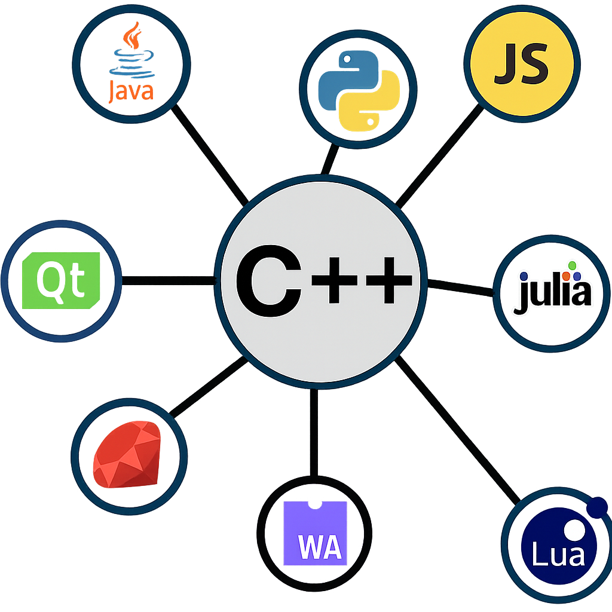

# Rosetta — A C++ Automatic Language Binding

# **One registration, infinite possibilities** 🚀

  

  
  
  

  
  
  
  
  
  
  

  
  

---

## 🧩 Overview

**Rosetta** is a **non-intrusive C++ introspection library** that automatically generates bindings for Python, JavaScript, Lua, and more — without modifying your C++ code.
Write your classes once, and export them everywhere.

Rosetta supports two complementary workflows:

1. **Direct C++ registration** using C++ introspection. This type of registration is fine grained and let you control everything
2. **Interface Description Language (IDL)** via YAML or JSON files. You do not need to know anything about the underlaying libs that are used for the bindings (NAPI, Pybind11...)

---

## ✨ Features

1. **Zero-intrusion** — No inheritance, no macros inside your classes, no wrapper
2. **Simple to use**
3. **One API -> Multi-language output** — Python (pybind11), JavaScript (N-API), Lua, WASM, C#
4. **Multiple constructors**
5. **Functors support**
6. **Virtual fields** - From `setDummy`/`getDummy`, create the virtual field `Dummy`
7. **Free functions support**
8. **Container support** — `std::vector`, `std::map`, `std::optional`, etc.
9. **Smart pointers** — `shared_ptr`, `unique_ptr`, raw pointers
10. **Inheritance & polymorphism** — Virtual methods, multiple inheritance
11. **Const correctness** — Differentiates const/non-const methods
12. **Validation system** — Runtime constraints and checks
13. **Serialization**
14. **Documentation generation** — Markdown / HTML export

## [Short overview](SHORT_README.md)
## [Long overview](LONG_README.md)

## 📜 License

LGPL 3 License — see [LICENSE](LICENSE)

---

## 💡 Credits

[Xaliphostes](https://github.com/xaliphostes) (fmaerten@gmail.com)

