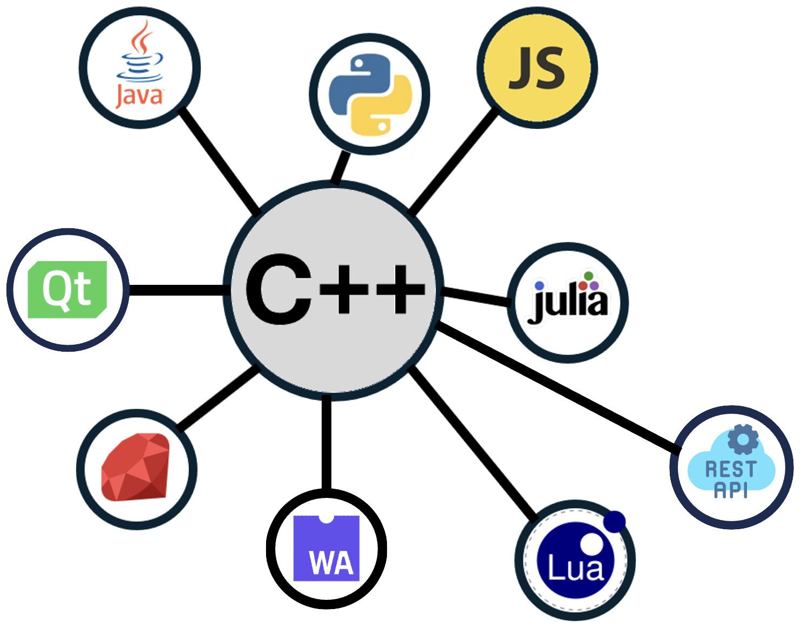

<p align="center">
  
</p>

# Rosetta

A C++26 reflection playground that generates Python, Node, REST, WebAssembly, Julia, OpenAPI, JSON, TypeScript, Markdown... bindings for **your existing classes — without modifying them**. Point rosetta at a header via a small `manifest.json`, run one tool, get per-language binding projects out.

Annotations (`doc`, `range`, `readonly`, …) are an *opt-in* enrichment, not a requirement: add them where you want docstrings, validation, or UI hints; leave the rest of the class alone. Reflection does the work either way.

[QUICKSTART](docs/QUICKSTART.md)


[](https://xaliphostes.github.io/rosetta/#1)

## Features

Everything below is discovered by **reflection** from your unmodified headers — you declare *what* to bind in `manifest.json`, never *how*.

**What rosetta can bind**

- **Public fields** — exposed as read/write properties, with per-backend getters/setters.
- **Public methods** — both instance and `static` members.
- **Multiple constructors** — default *and* parameterized; each overload is bound.
- **Enums** — `enum` / `enum class`, with enumerators surfaced as named constants.
- **Free (non-member) functions** — declared in the manifest, no edit to your headers ([details](docs/FREE_FUNCTIONS.md)).
- **Nested user types & `std::vector`** — `Surface` returning `Point`/`Triangle`, vector members, etc. are marshalled across the language boundary.
- Members a backend can't marshal (e.g. `std::function` params) are **skipped**, not fatal.

**Opt-in annotations** (enrich without intruding — see [annotations](docs/OTHER_ANNOTATIONS.md))

- `doc{"..."}` — docstrings / generated reference text.
- `readonly` — read-only property (write is rejected per backend).
- `range{lo, hi}` — value-range validation on assignment.
- `combobox{{...}}` — enumerated choices (UI hint).

Don't want to touch the header at all? Provide the same annotations **out of line**, from a JSON string attached to the type elsewhere — even in another file:

```cpp
struct MyClass {
    int value = 0;
};

// Add annotation later on in another file
template <>
constexpr std::string_view rosetta::ann_json_source<MyClass> = 
  R"({ "value": { "range": [1, 9] } })";
```

In a manifest-driven build you don't write that by hand: add an `"annotations": "Type.ann.json"` field to the class in `manifest.json` and rosetta bakes the external file in for you. Either way the metadata is merged with any inline annotations and reaches every backend (Python, Node, REST, OpenAPI, …) — see [out-of-line annotations](docs/OUT_OF_LINE_ANNOTATIONS.md).

**Backends** (one combined module per target, from a single generator)

| Target | Output | C++26 status |
|---|---|---|
| **Python** | pybind11 extension module | ✅ Working |
| **Node** | N-API native addon | ✅ Working |
| **Julia** | CxxWrap.jl / jlcxx shared module | ✅ Builds & runs <br> ⚠️ `std::vector` skipped (fork libc++ gap) |
| **WebAssembly** | Emscripten/embind module | ⚠️ Needs reflection-aware emsdk |
| **REST** | cpp-httplib JSON server (CRUD + method routes) + a generated `index.html` browser client, with `/openapi.json` and Swagger UI at `/docs` | ✅ Working |
| **OpenAPI** | OpenAPI 3.1 spec describing the REST surface — annotations become schema constraints (`range`→min/max, `readonly`→readOnly, `combobox`→enum) | ✅ Working |
| **JSON** | reflection-based nlohmann (de)serialization — one reusable `json_visitor.h`, no per-type code | ✅ Working |
| **TypeScript** | ambient `.d.ts` type declarations | ✅ Working |
| **Markdown** | API reference document | ✅ Working |

New backends register without touching the generator — see [EXTENDING_BACKEND](docs/EXTENDING_BACKEND.md).

## Mini-MOC — Qt signals / slots / properties, without moc

Beyond binding generation, rosetta ships [`mini_moc.h`](include/rosetta/mini_moc.h): a header-only, **moc-less** reimagining of Qt's signals/slots/properties built directly on C++26 reflection (P2996) + annotations (P3394). No code generator, no separate compile step — just annotate members and connect them.

You mark members with annotations and reach them through three free functions:

```cpp
#include <rosetta/mini_moc.h>
namespace moc = rosetta::moc;

class Person {
public:
    [[= moc::signal]] moc::Signal<std::string const &> nameChanged;
    [[= moc::signal]] moc::Signal<int>                 ageChanged;

    [[= moc::property{"name", "nameChanged"}]] std::string m_name;
    [[= moc::property{"age",  "ageChanged"}]]  int         m_age = 0;
    [[= moc::property{"id"}]]                   int         m_id  = 0;   // no NOTIFY
};

struct Logger {
    [[= moc::slot]] void onAge(int v)               { total += v; }
    [[= moc::slot]] void onName(std::string const&) { /* ... */ }
    int total = 0;
};

Person p; Logger l;
moc::connect<"ageChanged", "onAge">(p, l);  // compile-time checked
moc::set<"age">(p, 30);                      // equality-gated; fires NOTIFY -> Logger::onAge
moc::get<"age">(p);                          // -> 30
```

- **Annotations** — `signal`, `slot`, `property{"name", "notifySig"}` mark members; reflection discovers them.
- **`connect<"sig","slot">(sender, receiver)`** — compile-time checked: a wrong name is a `static_assert`, mismatched argument types are a template error.
- **`get<"prop">` / `set<"prop">`** — property access from outside the class (token injection, P3294, isn't in clang-p2996 yet, so accessors aren't emitted into the class body). `set<>` is equality-gated and fires the property's `NOTIFY` signal only on an actual change.
- **`Signal<Args...>`** — the only machinery type you spell out; supports `connect` / `disconnect` / `disconnect_all`, re-entrant self-disconnect, and a `ScopedConnection` RAII handle for scope-bound connections.

See the [`examples/moc`](examples/moc) demo and the test suite in [`tests/moc.cpp`](tests/moc.cpp).

## Status

Prototype. Tracks the in-flight C++26 reflection papers:

- **P2996** — reflection (`^^T`, `[: r :]` splice, `std::meta::*`)
- **P3394** — annotation attributes (`[[= rosetta::doc{"..."}]]`)
- **P3294** — token injection (not yet used; see notes in `mini_moc.h`)

Builds with the Bloomberg [clang-p2996 fork](https://github.com/bloomberg/clang-p2996).
No mainline compiler implements enough of these proposals yet.

## Requirements

- A clang-p2996 build at `$HOME/devs/c++/clang-p2996/build` (or override `CLANG_P2996_ROOT` when invoking cmake).
- CMake 3.28+, Ninja or Make.
- C++26 mode with the fork's flags: `-freflection -freflection-latest -fexperimental-library`. Annotation-using code also needs `-fannotation-attributes`.


## Build the test suite

```bash
cd tests
cmake -B build
cmake --build build
./build/hello
./build/moc
./build/docgen
# ...
```

Each test is self-contained; pick by name (see `tests/CMakeLists.txt`).

## A taste — bind your existing library

You have this header. Don't change it:

```cpp
// my_lib/person.h
#include <string>

struct Person {
    std::string name;
    int         age = 0;
    std::string id;
    std::string greet(const std::string &salutation) const;
};
```

Write a small `manifest.json` next to it. Each `targets` entry names the module/library produced for that backend; list every class you want bound:

```json
{
  "user_include": "../my_lib",
  "rosetta_include": "/path/to/rosetta/include",
  "targets": [
    { "lang": "python", "name": "person_py" },
    { "lang": "node",   "name": "person_js" }
  ],
  "classes": [
    { "name": "Person", "header": "person.h" }
  ]
}
```

Build the scaffolder once, then from your project folder generate, build, and run the project-specific tool it emits:

```bash
# (one-time) build the framework scaffolder → <repo>/bin/rosetta_gen
cmake -S tools/rosetta_gen -B tools/rosetta_gen/build
cmake --build tools/rosetta_gen/build

# from the folder holding manifest.json:
#   write the generator project (bindings.h + <generator_name>.cpp + CMakeLists.txt)
#   into a folder you name — here `gen/`
/path/to/rosetta/bin/rosetta_gen manifest.json gen

# build it — the `generator` binary is dropped into the current folder,
# not the build tree
cmake -S gen -B gen/build && cmake --build gen/build

# run it → one combined module per backend under bindings/
./generator bindings
```

Result: `bindings/{python,node}/` — each a self-contained CMake project exposing **all** your classes in a single module. `cd bindings/python && cmake -B build && cmake --build build`, then `import person_py`.

> `generator_name` and `module_name` are optional manifest fields: `generator_name` (the generated `.cpp` / usage name) defaults to the manifest's folder name, and a bare-string target like `"node"` falls back to `module_name` for its module name.

The full walkthrough is in [`docs/QUICKSTART.md`](./docs/QUICKSTART.md); the manifest schema, the `binding_info<T>` trait, and the layered tooling model are in [`docs/GENERATE.md`](./docs/GENERATE.md). The worked examples live in `examples/manifest/` and `examples/geom-lib/`.

## Examples

| Path                       | What it shows                                       |
|----------------------------|-----------------------------------------------------|
| `examples/manifest`        | Manifest-driven generation for `Person` (no class modification) |
| `examples/annotate-manifest`| Out-of-line annotations from an external JSON file, wired by the manifest's `annotations` field ([details](docs/OUT_OF_LINE_ANNOTATIONS.md)) |
| `examples/geom-lib`        | Manifest-driven bindings for a small geometry library (nested types, vectors) |
| `examples/moc`             | Qt-flavoured meta-object demo on `mini_moc.h` (properties + signals) |
| `examples/docgen`          | Reflection-driven Markdown reference generator      |
| `examples/qt`              | Building a Qt widget form from a reflected struct   |
| `examples/qml`             | Exposing a reflected C++ object to QML              |
| `examples/bindings/python` | Hand-written pybind11 backend (reference)           |
| `examples/bindings/node`   | Hand-written N-API backend (reference)              |
| `examples/bindings/julia`  | Hand-written CxxWrap/jlcxx backend (reference, requires CxxWrap.jl) |
| `examples/bindings/rest`   | Hand-written HTTP/REST backend (reference)          |
| `examples/bindings/web`    | Hand-written WebAssembly backend (requires reflection-aware emsdk) |

## Design notes

- [Quick start](docs/QUICKSTART.md) — five-step guide to generating bindings for an existing library
- [Extending](docs/EXTENDING_BACKEND.md) — how to extend the rosetta backend
<br><br>
- [Generate](docs/GENERATE.md) — full reference for `rosetta::generate`, the manifest schema, and the tool layering
- [Free functions](docs/FREE_FUNCTIONS.md) — sketch for reflecting namespace-scope functions
- [Other annotations](docs/OTHER_ANNOTATIONS.md) — proposed annotation kinds beyond the current three
- [Out-of-line annotations](docs/OUT_OF_LINE_ANNOTATIONS.md) — keep headers clean: `#embed` a JSON side-car of annotations, merged at compile time
- [Todo list](docs/TODO.md) — what the walker and visitor surface still miss (enums, bases, ctors, statics, parameter metadata, ...)

## License

[MIT](./LICENSE)

## Author
[xaliphostes](https://github.com/xaliphostes)