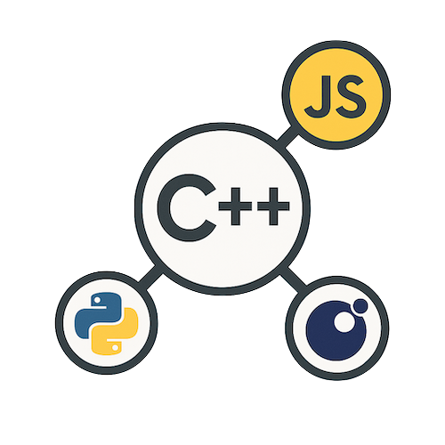

# Rosetta — A C++ Automatic Language Binding

<p align="center">
  
</p>

<p align="center">
  
  
  
</p>

<p align="center">
  
  
</p>

---

## 🧩 Overview

**Rosetta** is a **non-intrusive C++ introspection library** that automatically generates bindings for Python, JavaScript, Lua, and more — without modifying your C++ code.
Write your classes once, and export them everywhere.

Rosetta supports two complementary workflows:

1. **Direct C++ registration** using introspection macros.
2. **Interface Description Language (IDL)** via YAML or JSON files.

---

## ✨ Features

* **Zero-intrusion** — No inheritance, no macros inside your classes
* **Multi-language output** — Python (pybind11), JavaScript (N-API), Lua, WASM
* **Container support** — `std::vector`, `std::map`, `std::optional`, etc.
* **Smart pointers** — `shared_ptr`, `unique_ptr`, raw pointers
* **Inheritance & polymorphism** — Virtual methods, multiple inheritance
* **Const correctness** — Differentiates const/non-const methods
* **Validation system** — Runtime constraints and checks
* **Documentation generation** — Markdown / HTML export

---

## 🚀 Quick Start

You can start from either **IDL** or **C++ registration** — both approaches produce the same bindings.

### [A. Using IDL](#using-idl)

Create a simple YAML file to describe your API, then generate bindings directly from it.

### [B. Using Rosetta Registration](#using-rosetta)

Register classes in C++, then generate bindings automatically.

---

<a id="using-idl"></a>
## 🧾 Interface Description Language (IDL)

Rosetta can use a **YAML-based Interface Description Language** to describe your classes, methods, and functions independently of source code.
This file serves as a **neutral schema** to generate bindings in multiple target languages.

### Why use IDL?

* 📄 **Language-agnostic:** One file → multiple bindings
* 🔄 **Automation-friendly:** Easy regeneration when interfaces change
* 🧩 **Decoupled:** No need to modify or recompile your C++ source

---

### Example: `geometry.yaml`

```yaml
module:
  name: geometry
  version: 1.0
  namespace: geom

includes:
  - vector_math.h

classes:
  - name: Vector3D
    fields:
      - { name: x, type: double }
      - { name: y, type: double }
      - { name: z, type: double }
    methods:
      - { name: length, returns: double }
      - { name: normalize, returns: void }

functions:
  - name: dot
    returns: double
    args:
      - { name: a, type: Vector3D }
      - { name: b, type: Vector3D }
```

---

### Generate Bindings

You can use the same file to generate **JavaScript** or **Python** bindings:

```bash
python3 rosetta_idl.py --input example/geometry.yaml --lang js --output ./example/bindings
python3 rosetta_idl.py --input example/geometry.yaml --lang py --output ./example/bindings
```

Both commands share the same description — only the `--lang` argument changes.

Go to the folder where the binding was generated and compile it (see the generated README for each binding)

---

<a id="using-rosetta"></a>
## 🧠 Using Rosetta Registration

If you prefer working directly in C++, Rosetta can automatically introspect your classes via lightweight registration calls.

### 1. Define Your Classes

```cpp
class Vector3D {
public:
    double x, y, z;

    double length() const {
        return std::sqrt(x*x + y*y + z*z);
    }

    void normalize();
};
```

### 2. Register with Rosetta

```cpp
#include "rosetta/rosetta.h"

void register_types() {
    ROSETTA_REGISTER_CLASS(Vector3D)
        .field("x", &Vector3D::x)
        .field("y", &Vector3D::y)
        .field("z", &Vector3D::z)
        .method("length", &Vector3D::length)
        .method("normalize", &Vector3D::normalize);
}
```

This registration enables all generators to expose the same interface across languages.

---

### 3. Generate Python Bindings

```cpp
#include <pybind11/pybind11.h>
#include "rosetta/generators/python_binding_generator.h"

BEGIN_MODULE(my_module, m) {
    register_types();
    rosetta::generators::PythonBindingGenerator(m)
        .bind_class<Vector3D>();
}
END_MODULE(my_module)
```

**Python usage:**

```python
import my_module

v = my_module.Vector3D()
v.x, v.y, v.z = 3.0, 4.0, 0.0
print(v.length())  # 5.0
v.normalize()
```

---

### 4. Generate JavaScript Bindings

```cpp
BEGIN_MODULE(my_module)
{
    rosetta::generators::JavaScriptBindingGenerator(env, exports)
        .bind_class<Vector3D>();

    return exports;
}
END_MODULE(my_module)
```

**JavaScript usage:**

```js
const my_module = require('./build/Release/my_module')

const v = new my_module.Vector3D()
v.x = 3.0
v.y = 4.0
v.z = 0.0
console.log(v.length())  // 5.0
v.normalize()
```

---

## 🧬 Advanced Features

* [Inheritance](#inheritance)
* [Validation](#validation)
* [Multiple Binding Generators](#multiple-bindings)

### Inheritance

```cpp
class Shape {
public:
    virtual double area() const = 0;
};

class Circle : public Shape {
public:
    double radius;
    double area() const override;
};

ROSETTA_REGISTER_CLASS(Shape)
    .pure_virtual_method<double>("area");

ROSETTA_REGISTER_CLASS(Circle)
    .inherits_from<Shape>("Shape")
    .field("radius", &Circle::radius)
    .override_method("area", &Circle::area);
```

### Validation

```cpp
using namespace rosetta;

ConstraintValidator::instance()
    .add_field_constraint<Circle, double>(
        "radius",
        make_range_constraint(0.0, 1000.0)
    );
```

### Multiple Bindings

```cpp
rosetta::PythonGenerator py_gen;
rosetta::JavaScriptGenerator js_gen;
rosetta::TypeScriptGenerator ts_gen;
rosetta::DocGenerator doc_gen;
```

---

## ⚙️ Installation

### Requirements

* C++20 or later
* CMake ≥ 3.15
* Optional: `pybind11`, `NAPI`, `emscripten`

### Build

```bash
git clone https://github.com/yourusername/rosetta.git
cd rosetta && mkdir build && cd build
cmake ..
make
```

### Integrate into Your Project

```cmake
add_subdirectory(rosetta)
target_link_libraries(your_target rosetta::rosetta)
```

Or header-only:

```cpp
#include "rosetta/rosetta.h"
```

---

## 🧱 Architecture

```
rosetta/
├── core/          # Core introspection engine
├── traits/        # Type detection
├── generators/    # Python, JS, TypeScript
└── extensions/    # Serialization, validation, docs
```

---

## 🧩 Architecture Layers

```
┌─────────────────────────────────────────────────────────┐
│                   JavaScript Layer                      │
│  (Node.js code using addon.Vector3D(), etc.)            │
└─────────────────────────────────────────────────────────┘
                          ↕
│                    N-API Bridge                         │
│  (Napi::Object, Napi::Function, Napi::Value)            │
...
│                 Rosetta Core Layer                      │
│  - Introspection, Registry, Any type                    │
└─────────────────────────────────────────────────────────┘
```

---

## 🧪 Examples

See `examples/` for complete projects

---

## 📊 Comparison

| Feature          | Rosetta | pybind11 | SWIG | Boost.Python |
| ---------------- | ------- | -------- | ---- | ------------ |
| Non-intrusive    | ✅       | ✅        | ✅    | ❌            |
| Modern C++       | ✅       | ✅        | ⚠️   | ⚠️           |
| Zero boilerplate | ✅       | ❌        | ❌    | ❌            |
| Multiple targets | ✅       | ❌        | ✅    | ❌            |
| Type-safe        | ✅       | ✅        | ⚠️   | ✅            |

---

## ⚠️ Limitations

* Requires explicit registration or IDL description
* Template classes must be instantiated manually
* Operator overloading must be declared manually

---

## 🤝 Contributing

Contributions welcome!
Please read [CONTRIBUTING.md](CONTRIBUTING.md).

---

## 📜 License

LGPL 3 License — see [LICENSE](LICENSE)

---

## 💡 Credits

Created by [Xaliphostes](https://github.com/xaliphostes) (fmaerten@gmail.com)

---

**One registration, infinite possibilities.** 🚀
