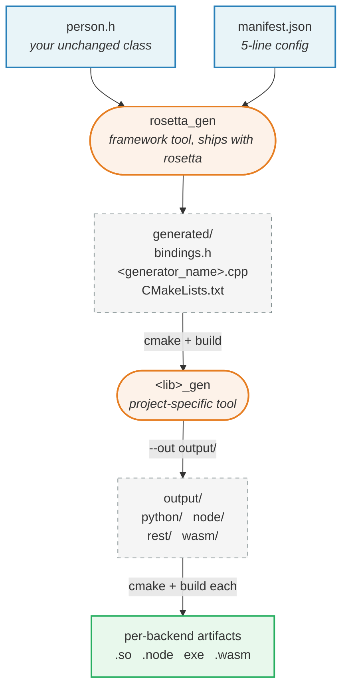

# Quickstart — generate bindings for your library

You have a C++ library with one or more classes. You want Python /
Node / REST / WASM bindings without writing each one by hand. Five
steps. You don't have to modify your class definitions at all — and
*if* you want richer bindings, you can opt in with member-level
annotations later.

## The workflow at a glance



Blue = you write it. Orange = a tool you run. Dashed grey = generated
output. Green = the finished binding artifacts.

Two stages of generation, two CMake builds — described step by step
below.

## 0. Prerequisites

- The clang-p2996 fork at `$HOME/devs/c++/clang-p2996/build`
  (override with `-DCLANG_P2996_ROOT=…`).
- CMake ≥ 3.28, Ninja, a system C++26 compiler.
- For Python: `pip install pybind11`. For Node: `npm`. For Web: emsdk.

## 1. Your class — leave it as-is

Rosetta is non-intrusive. Your existing class definitions don't have
to change at all:

```cpp
// my_lib/person.h
#include <string>

struct Person {
    std::string name;
    int         age = 0;
    std::string id;
    std::string greet(const std::string &salutation) const;
};
```

Reflection alone is enough — fields and methods get bound, names match
the C++ identifiers, types are mapped automatically. You won't get
docstrings, range checks, or "readonly" semantics out of the box, but
everything works.

### Optional: enrich the bindings with member annotations

If you *want* docstrings, validation, UI hints, or readonly semantics
on a particular field, add a member-level annotation. The class shape
is unchanged; annotations sit inside `[[…]]` next to each field or
method.

```cpp
#include <rosetta/annotations.h>

struct Person {
    [[ = rosetta::doc{"display name"} ]]
    std::string name;

    [[ = rosetta::doc{"age in years"},
       = rosetta::range{0.0, 150.0} ]]
    int age = 0;

    [[ = rosetta::doc{"server-assigned id"},
       = rosetta::readonly{} ]]
    std::string id;

    [[ = rosetta::doc{"Greet someone."} ]]
    std::string greet(const std::string &salutation) const;
};
```

Mix and match: annotate the fields where the extra metadata pays off,
leave the rest alone. Available annotations: `doc`, `range`,
`readonly`, `combobox`, `label`, `button`,
`widget::{slider,checkbox,…}` — see `include/rosetta/annotations.h`.

## 2. Write a `manifest.json`

One file, lives anywhere — paths inside are resolved relative to it.

```json
{
  "user_include": "../my_lib",
  "rosetta_include": "/path/to/rosetta/include",
  "generator_name": "my_person_gen",
  "targets": ["python", "node", "rest", "wasm"],
  "classes": [
    {
      "name": "Person",
      "header": "person.h"
    }
  ]
}
```

- `user_include` — where your class headers live.
- `rosetta_include` — where rosetta's `include/` lives.
- `generator_name` — name of the generated scaffolder tool / CMake target.
- `targets` — any subset of `python`, `node`, `rest`, `wasm`; shared by every class.
- `classes[].header` — required; `classes[].name` is optional and defaults
  to the header's basename. Each class's binding library is derived as
  `reflected_<lowercase name>`.

## 3. Build the framework tool (one time)

```bash
cmake -G Ninja -S tools/rosetta_gen -B tools/rosetta_gen/build
cmake --build tools/rosetta_gen/build
```

## 4. Generate, build, run

```bash
# (a) read manifest → emit project-specific tool source
./tools/rosetta_gen/build/rosetta_gen path/to/manifest.json

# (b) build that tool (named <generator_name> — here my_person_gen)
cmake -G Ninja -S path/to/manifest_dir/generated \
                -B path/to/manifest_dir/generated/build
cmake --build path/to/manifest_dir/generated/build

# (c) run it → emit a per-backend project tree under --out
./path/to/manifest_dir/generated/build/my_person_gen \
    --out path/to/output
```

Result:

```
path/to/output/
  python/ auto_pybind.cpp     CMakeLists.txt              README.md
  node/   auto_napi.cpp       CMakeLists.txt  package.json README.md
  rest/   auto_rest.cpp       CMakeLists.txt              README.md
  wasm/   auto_emscripten.cpp CMakeLists.txt              README.md
```

## 5. Build a backend

Each directory is a self-contained CMake project.

```bash
cd path/to/output/python
cmake -G Ninja -B build && cmake --build build
python -c "import my_person; p = my_person.Person(); p.name = 'Alice'; print(p.greet('Hi'))"
```

Node needs `npm install` + `npx cmake-js compile`. Web needs `emcmake
cmake …`. Rest pulls cpp-httplib + nlohmann/json via FetchContent on
first configure.

## Changing things

| Change | What to do |
|---|---|
| Edit a class field/method (add, remove, retype) | Rebuild the backend (`cmake --build` in step 5's dir) — reflection picks up the new shape automatically. |
| Add or change a member annotation (`doc`, `range`, …) | Same — rebuild the backend. The README/docstrings/validation update. |
| Add a class, change `lib` or `targets` | Re-run step 4 (a) → (b) → (c). |
| Move the manifest file | Re-run step 4 — paths resolve relative to the manifest. |

That's it. `person.h` is yours to keep pristine or to enrich, your
call; everything outside it is generated from `manifest.json` plus
reflection.
